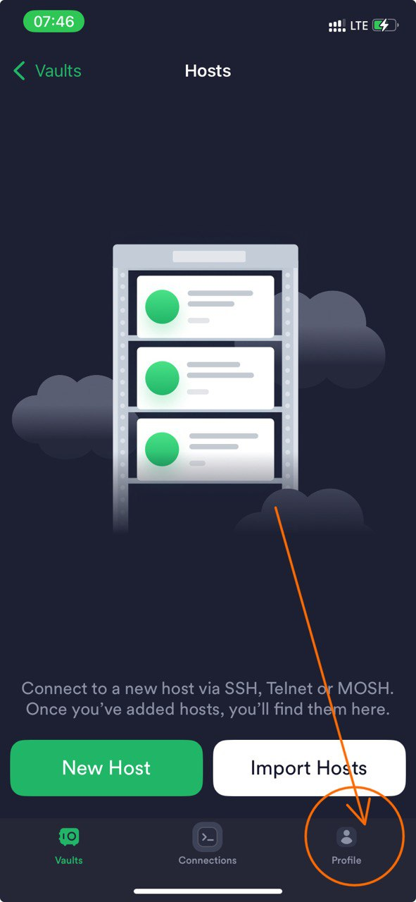
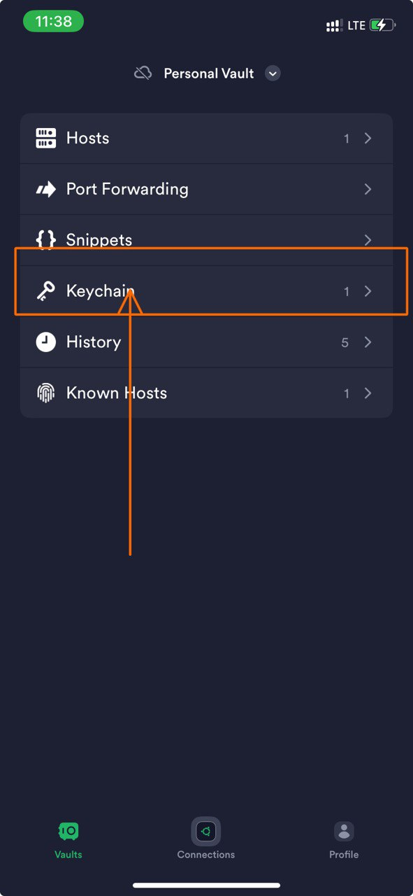

# 🛡️ SSH into AWS EC2 Instance using Termius on iOS

This guide walks you through connecting to your AWS EC2 instance from an iPhone or iPad using the **Termius app**.

---

## ✨ Prerequisites

- ✅ AWS EC2 instance (running)
- ✅ Public IP address of the instance
- ✅ `.pem` key file (downloaded when you created the instance)
- ✅ Termius app on iOS → [App Store link](https://apps.apple.com/us/app/termius-ssh-client/id549039908)

---

## 📲 Step-by-Step Guide

---

### 🔹 1. Install & Launch Termius

- Download **Termius** from the App Store.
- Open the app and choose **Guest Mode** or sign in as shown in the image.

    

---

### 🔹 2. Import Your `.pem` Key

- Tap `Keychain` → `+` → **Import Key**.
- Select your `.pem` file from iCloud Drive, Files app, or AirDrop it in.

     

💡 Give the key a clear name like `aws-key-ec2.pem`.

---

### 🔹 3. Add a New Host

- Tap `Hosts` → `+`
- Fill in the details:

| Field       | Value Example                  |
|-------------|-------------------------------|
| Label       | My EC2 Server                 |
| Address     | 13.245.112.21 (your public IP)|
| Port        | 22                            |
| Username    | ubuntu / ec2-user             |
| Use Key     | Select the key you just added |

**📸 Placeholder for screenshot of host configuration**

---

### 🔹 4. Connect!

- Tap the host from the list
- You’ll see a terminal appear and (hopefully) a successful connection 🎉

---

## 🧯 Troubleshooting

| ❗ Error                              | 🔎 Cause                               | ✅ Fix                                   |
|--------------------------------------|----------------------------------------|------------------------------------------|
| `Permission denied (publickey)`      | Wrong key or username                  | Make sure the `.pem` file is correct and username is `ubuntu` or `ec2-user` |
| `Host unreachable`                   | IP is wrong or instance is stopped     | Check your EC2 dashboard and verify IP   |
| `Connection timed out`               | Port 22 blocked                        | Open port 22 in EC2 **Security Group**   |

---

## 💡 Notes

- **Default usernames:**
  - `ubuntu` for Ubuntu
  - `ec2-user` for Amazon Linux
- Security Groups must allow **Inbound SSH (TCP 22)** from your IP.
- Use `chmod 400 your-key.pem` if you ever use this key in Linux/macOS.

---

## 🗺️ Visual Diagram

